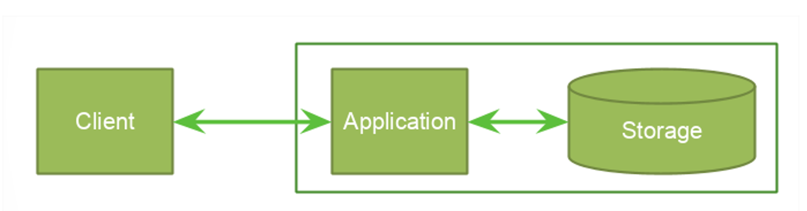
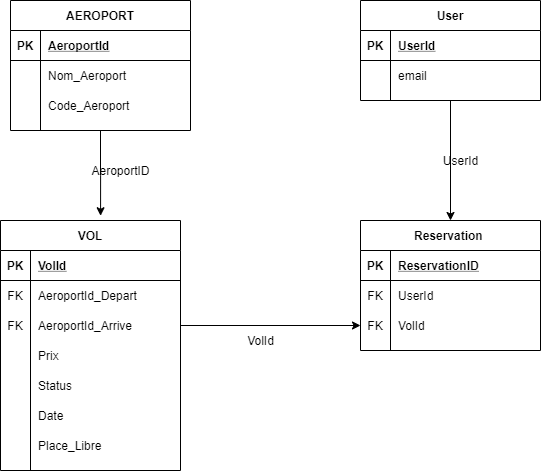

### Architecture globale :
	- Architecture MVC
	

### Modèle de donnée :
	- Type de données :
		- JSON
		- ArrayList
	- Objets :
		- Aéroport
		- Réservations
		- Vols
		- Utilisateurs
		

### Stack Technique :
	- Frontend : 
		- HTML, CSS, JQuery
	- Backend :
		- JAVA
	- Framework :
		- AngularJS
	- IDE :
		- Intellij
	- Partage du code :
		- GitHub
